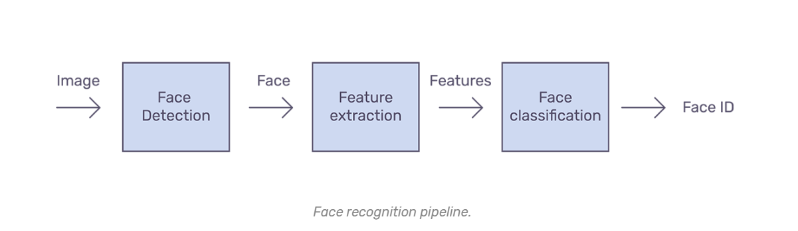
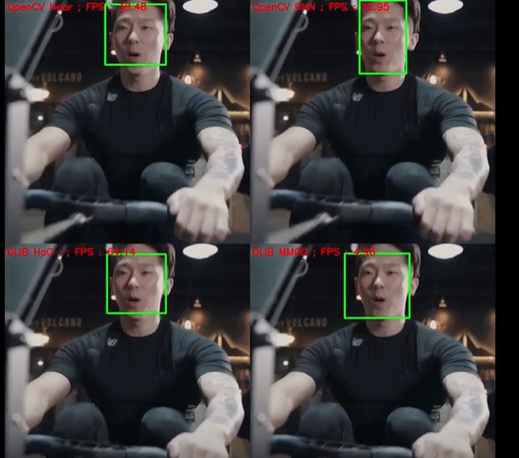
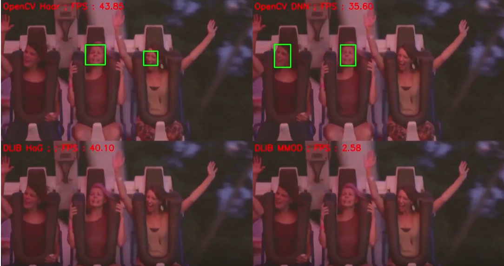
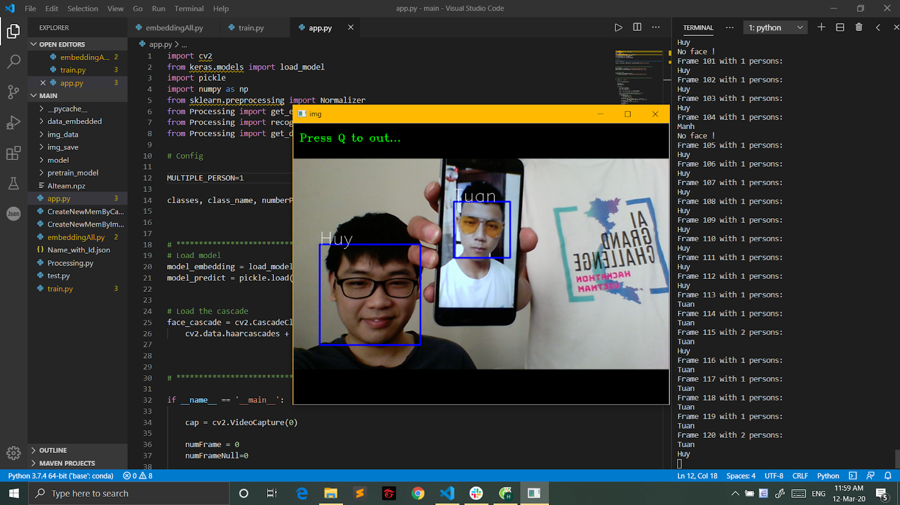


# Face Check
======================================================

### Mục lục

[I. Mở đầu](#overview)

[II. Phát hiện khuôn mặt (Detect Face)](#detect)

[III. Nhận diện khuôn mặt (Face Recognize)](#recognize)

[IIII. Quick start](#demo)

======================================================

## I. Mở đầu

FaceCheck giải quyết bài toán chấm công trong công ty.
Mã nguồn này sử dụng SVM để phân loại cho độ chính xác cao hơn KNN, do đó bản chất để sử dụng trên một tập cơ sở dữ liệu ảnh có sẵn các thành viên và không nhận Unknow

Trong FaceCheck có 2 bài toán cần giải là:

- Detect Face.

- Face Recognize ( Trong Face recognize sẽ có 2 phần là extract feature và classification ):

## II. Phát hiện khuôn mặt

- Có thể sử dụng Haar Cascade hoặc các thuật toán như DNN, HoG, MMOD, hoặc MTCNN.

- Một số kiểm tra thực tế: https://www.youtube.com/watch?v=kKaU6JFRu5g

- Tốc độ: MMOD < MTCNN(3fps trên UTK Face Dataset) < DNN < Haar <HoG

- Có thể sử dụng trong bài toán realtime 3 thuật toán là DNN, Haar và HoG do thời gian chạy nhanh. Trong khi MMOD và MTCNN chạy quá chậm 

- Qua thực tế có thể thấy Haar và DNN detect tốt hơn HoG, HoG tuy nhanh nhất nhưng chỉ detect được face ở một size cố định, size nhỏ sẽ không detect được..

- So sánh Haar và DNN thì thời gian chạy của Haar nhanh hơn DNN tầm 4/3 đến 5/3 lần. Độ chính xác thì Haar thua DNN một chút nhưng không đáng kể

- Mà trong bài toán còn phần recognize, do đó sẽ lựa chọn thuật toán Haar để tối ưu thời gian và trải nghiệm người dùng

## III. Nhận diện khuôn mặt (Face Recognize)

### 1. Extract feature

- Một trong những kiến trúc mạnh nhất và chính xác nhất hiện tại đã public là arcFace, nhưng do tốc độ chậm nên ưu tiên sử dụng FaceNet để extract feature cho bài toán realtime. 

- Pretrained model: https://drive.google.com/drive/folders/12aMYASGCKvDdkygSv1yQq8ns03AStDO_
Resize ảnh về shape (160,160,3) chuẩn input của mạng FaceNet. Đầu ra output cho mỗi ảnh là một embedded vector 128 chiều
	
### 2. Classification

- Sử dụng SVM để phân loại cho độ chính xác cao hơn KNN, do đó sử dụng SVM.

## IIII. Quick start

- Clone project này về máy, cd vào thư mục facecheck.

- Install python, pip, pip enviroment. Bật pip enviroment và install các thư viện cần thiết trong file requirement.txt, tải pretrain facenet trong driver trên để vào folder pretrain_model

- Thêm người vào csdl: Vào CreateNewMemByCam.py sửa biến ở Config sau đó chạy lệnh `python CreateNewMemByCam.py`, lấy khoảng 20-30 ảnh.

- Vào embeddingOne.py, sửa name cần thêm giống file trước rồi chạy `python embeddingOne.py`

- Run `python embeddingOne.py` để train lại model.

- `python app.py`

- Bấm 'q' để thoát
